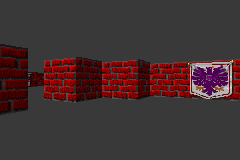

# GBA Raycaster

A very basic implementation of Lode's Computer Graphics ray-caster (https://lodev.org/cgtutor/raycasting.html) for the Game Boy Advance.

## Building

Uses [gba-toolchain](https://github.com/felixjones/gba-toolchain) to build.

I recommend using a CMake compatible IDE such as CLion or Visual Studio Code.

Debug build is VERY slow.
Use RelWithDebInfo for development.
Clang also gives a bit of a performance boost.

## About

This isn't fully optimised, for example no look-up-tables are used (which could help a fair bit).
This is more of a proof-of-concept demonstrating how ray-casting engines are not the most optimal way to render 3D graphics.

The `other` directory has various alternative implementations at various stages of optimisation.

## Licence

Do what you want. No support provided. If you do make a game out of this, then send screenshots.

## Contributing

If you find a cool optimisation then make a pull request and I'll review it.
